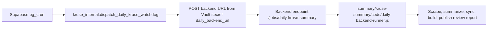

# Daily Kruse Pipeline

End-to-end daily process for the public Kruse report site, canonical Supabase
sync, live NotebookLM Drive-file refresh when configured, and approved
mailing-list email send.

## Current Shape

Yes, there is a daily process. It is not a GitHub Actions daily job.

The daily process is:



- Supabase owns the time-zone-aware schedule.
- The backend URL owns execution.
- GitHub Actions is not the daily scheduler and not the daily executor.
- The old daily GitHub Actions runner and GitHub recovery runner are removed.
- GitHub remains the source repository. GitHub Pages remains a fallback/legacy
  public host during migration, but Hetzner can publish the static site directly
  with `KRUSE_SITE_PUBLISH_TARGET=hetzner-direct` or dual-publish with
  `KRUSE_SITE_PUBLISH_TARGET=both`.

## Scheduler

The scheduler lives in Supabase:

- SQL: `summary/kruse-summary/supabase/daily-watchdog-dispatch.sql`.
- Schema: `kruse_internal`.
- Table: `kruse_internal.daily_watchdog_dispatches`.
- Function: `kruse_internal.dispatch_daily_kruse_watchdog`.
- Cron jobs:
  - `kruse-daily-watchdog-0430-il-summer` at `30 1 * * *`.
  - `kruse-daily-watchdog-0430-il-winter` at `30 2 * * *`.
- Local window check: `04:25-04:45 Asia/Jerusalem`.

Supabase runs both UTC candidates needed for Israel summer/winter time. The DB
function checks `timezone('Asia/Jerusalem', now())` and only dispatches inside
the local window unless forced.

Required Supabase Vault secrets:

```text
daily_backend_url
daily_backend_token
```

`daily_backend_url` must be the backend endpoint, for example:

```text
https://backend.example.com/jobs/daily-kruse-summary
```

Supabase sends:

```json
{
  "source": "supabase-pg-cron",
  "mode": "normal",
  "date": "YYYY-MM-DD",
  "approved_send": true,
  "site_publish_target": "github-pages"
}
```

The HTTP response should be `202 Accepted` from the backend. Supabase records the
`pg_net` request ID in `kruse_internal.daily_watchdog_dispatches`.

## Backend Entry Points

The backend server runs:

```bash
cd summary/kruse-summary
npm run daily:backend-server
```

That starts `summary/kruse-summary/code/daily-backend-server.js`, which exposes:

- `GET /healthz`
- `GET /jobs/daily-kruse-summary`
- `POST /jobs/daily-kruse-summary`

`POST /jobs/daily-kruse-summary` requires:

```http
Authorization: Bearer <KRUSE_DAILY_BACKEND_TOKEN>
```

The server starts one backend runner process at a time:

```bash
node summary/kruse-summary/code/daily-backend-runner.js --mode=normal --date=YYYY-MM-DD
```

Direct backend cron can also run the same runner once every 24 hours. If both
direct backend cron and Supabase cron are enabled, keep only one as primary or
the duplicate guards will skip the second run.

Backend deployment templates live in:

```text
summary/kruse-summary/deploy/
```

Use `summary/kruse-summary/deploy/README.md` for the systemd unit, backend env
file, health checks, and Supabase Vault cutover commands. That runbook is the
server-owned path; it is not a GitHub Actions setup.

## Backend Environment

The backend host must provide the production secrets and variables that used to
live in the daily Actions environment:

```text
KRUSE_DAILY_BACKEND_TOKEN
KRUSE_DAILY_BACKEND_HOST
KRUSE_DAILY_BACKEND_PORT
KRUSE_BACKEND_STATE_DIR
KRUSE_DAILY_INSTALL
KRUSE_DAILY_FAILURE_RECOVERY_SIGNAL
KRUSE_DAILY_FAILURE_RECOVERY_DISABLED
KRUSE_DAILY_QNA_FATAL
KRUSE_DAILY_GIT_USER_NAME
KRUSE_DAILY_GIT_USER_EMAIL
KRUSE_SITE_PUBLIC_BASE_URL
KRUSE_SITE_PUBLISH_TARGET
KRUSE_DIRECT_SITE_ROOT
KRUSE_DIRECT_SITE_RETAIN_RELEASES
NEXT_PUBLIC_SUPABASE_URL
NEXT_PUBLIC_SUPABASE_PUBLISHABLE_KEY
SUPABASE_SERVICE_ROLE_KEY
SUPABASE_MAILING_LIST_TABLE
SUPABASE_FEEDBACK_TABLE
SUPABASE_CARD_VOTES_TABLE
SUPABASE_CARD_VOTE_COUNTS_VIEW
GMAIL_USER
GMAIL_APP_PASSWORD
ANTHROPIC_API_KEY
XAPI_BEARER_TOKEN
XENFORO_COOKIE
FORUM_USERNAME
FORUM_PASSWORD
OPTIMAL_KLUBS_COOKIE
OPTIMALKLUBS_USERNAME
OPTIMALKLUBS_PASSWORD
GEMINI_API_KEY
KRUSE_ADMIN_ALERT_RECIPIENTS
KRUSE_BOT_TOKEN or backend git credentials for repo writes
KRUSE_YOUTUBE_CHANNEL_REFRESH_REQUIRED
KRUSE_YTDLP_PATH
KRUSE_YOUTUBE_CHANNEL_WRITE_DAILY_SUMMARY_SIDECAR
NOTEBOOKLM_RCLONE_LIVE
NOTEBOOKLM_RCLONE_REQUIRE_LIVE
NOTEBOOKLM_RCLONE_SOURCE_REGISTRY
NOTEBOOKLM_RCLONE_CONFIG
NOTEBOOKLM_RCLONE_REMOTE
```

`GMAIL_USER` and `GMAIL_APP_PASSWORD` are required for normal production daily
runs because the scheduler sends ready reports to the mailing list under Guy's
standing approval. Full-list delivery still requires an approved send path:
the Supabase watchdog payload sets `approved_send=true`, while manual runs must
use `--approved-send` or `KRUSE_DAILY_APPROVED_SEND=true`.

The backend should keep refreshed forum cookies in server-local state or an
approved backend secret store. It must not update GitHub Actions secrets as part
of the daily run.

## Production Cutover Checklist

The repo-side PR is not the same thing as live cutover. To cut over production:

1. Deploy the repo on the backend host.
2. Install `summary/kruse-summary/deploy/kruse-daily-backend.service.example`
   as the backend service.
   Install `summary/kruse-summary/deploy/kruse-codex-officer.path.example` as
   `kruse-codex-officer.path` so child-runner failures wake the existing Codex
   officer immediately.
3. Fill `/etc/kruse/daily-backend.env` from
   `summary/kruse-summary/deploy/kruse-daily-backend.env.example`.
4. Expose `POST /jobs/daily-kruse-summary` over HTTPS.
5. Store that URL as Supabase Vault secret `daily_backend_url`.
6. Store the matching `KRUSE_DAILY_BACKEND_TOKEN` as Supabase Vault secret
   `daily_backend_token`.
7. Apply `summary/kruse-summary/supabase/daily-watchdog-dispatch.sql`.
8. Run a build-only backend probe.
9. Only then merge/deploy the branch that removes the GitHub daily executor.

Steps 5-8 are live Supabase/backend operations and require explicit cutover
approval.

## Date And Approval Rules

The report date is not hardcoded:

1. If the Supabase payload or backend command includes `date`, use that exact
   `YYYY-MM-DD`.
2. Otherwise, compute the current day in `REPORT_TIME_ZONE`, default
   `Asia/Jerusalem`.
3. Pass that date to scraping, input building, AI summary, report rendering,
   Supabase canonical sync, NotebookLM refresh artifacts, real Gemini Notebook
   Drive source sync when enabled, public site build, and email send if
   approved.

Scheduled normal daily runs publish the report and then send the mailing-list
email once the public URL and source guards pass. This uses Guy's standing
approval in the Supabase watchdog payload. Manual retries still require an
explicit approved backend/manual run:

```bash
npm run daily:backend-run -- --mode=send-existing --date=YYYY-MM-DD --approved-send
```

Test recipient sends can pass `--test-recipients=<email>`. Test sends do not
update `last-sent.json`.

## Duplicate Guards

The backend runner checks state before spending API budget:

- `summary/kruse-summary/last-prepared.json` blocks duplicate normal rebuilds
  after a report has been prepared but not yet mailed.
- `summary/kruse-summary/last-sent.json` blocks duplicate production email.
- Supabase `daily_watchdog_dispatches` blocks duplicate backend dispatches
  inside the last 23 hours.
- The backend HTTP server allows one active daily runner at a time.
- The failure wake signal records `last-sent.json`, generated report existence,
  docs/site report existence, and the public report URL so Codex recovery can
  choose diagnosis-only, `send-existing`, or normal rebuild without duplicate
  sends/publishes.

## Daily Run Steps

The backend runner is intentionally linear. If a required step fails, later
steps do not run.

1. Validate backend environment before installs, scraping, Anthropic, Supabase
   sync, publishing, or email.
2. Check `last-sent.json` and `last-prepared.json`.
3. Install missing Node dependencies unless disabled by backend config.
4. Scrape X into `scrapers/twitter_to_md/data/<date>.json`.
5. Scrape forum activity into `scrapers/forum_to_md/daily/<date>.json`.
6. Backfill blog and Q&A summary state.
7. Fetch Optimal Klubs blog updates into
   `summary/kruse-summary/curated/<date>-blogs.json`.
8. Fetch LinkedIn Pulse articles into
   `summary/kruse-summary/curated/<date>-linkedin.json`.
9. Fetch Optimal Klubs Q&A/podcast pointers into
   `summary/kruse-summary/curated/<date>-podcasts.json`.
10. Refresh the owned YouTube channel with `yt-dlp`, import new caption
    transcripts into Supabase/Storage, and merge same-day imports into
    `summary/kruse-summary/curated/<date>-podcasts.json`.
11. Process podcast transcript sidecar rows so available transcripts are ready
    for report input.
12. Sync Supabase mailing-list rows into
   `summary/kruse-summary/mailing_list.json`.
13. Build combined input at
    `summary/kruse-summary/curated/<date>-input.json`.
14. Run the Anthropic daily digest chain and validation.
15. Render `summary/kruse-summary/out/<date>.html`.
16. Sync canonical daily rows to Supabase with
    `npm run db:daily-canonical-sync -- --date=<date> --execute`.
17. Build NotebookLM refresh artifacts into
    `summary/kruse-summary/out/notebooklm-refresh/<date>/`.
18. When `NOTEBOOKLM_RCLONE_LIVE=true`, update the real Gemini Notebook source
    files in place with `tools/notebooklm-rclone-sync.mjs --live`. Production
    uses the existing notebook
    `https://notebooklm.google.com/notebook/6a5093c8-9b6b-4a9c-82b4-f3c541171db0`
    and the existing 114-file Drive folder
    `1RTf8rCpc2_olBPURIOBpPz_5ELzQ754r`.
    The attached daily Drive file remains `twitter-daily.md`, but rclone writes
    the generated `daily-bundles/daily-sources-001.md` content into that stable
    file so NotebookLM sees the current daily JSON-derived source bundle.
    After this live rclone step succeeds, the backend reruns
    `db:daily-canonical-sync` for tweets/forum with
    `--notebooklm-daily-source-bundled`, which marks Supabase rows as daily
    NotebookLM-source bundled. If rclone fails, the marker sync is skipped and
    rows stay or are written as not bundled.
19. Optionally, when `NOTEBOOKLM_DRIVE_LIVE=true`, update a separate
    per-source Drive API registry with `tools/notebooklm-drive-publisher.mjs
    --live`. Do not enable both live paths unless their registries point at the
    same intended NotebookLM source set.
20. Build the static site in `summary/kruse-summary/site`.
21. Mirror the static site into `docs`.
22. Commit generated artifacts and push to `main`.
23. Publish the public Pages copy from `docs`.
24. Verify the live public report URL.
25. Send mailing-list email when the scheduler payload or manual runner includes
    an approved send path.
26. Skip mailing-list email only for build-only/manual unapproved runs.
27. Write `last-sent.json` only after approved email succeeds.

Production scheduled daily runs do not run test suites before scraping or
generating the report. Tests remain developer, PR, and explicit operator
preflight commands:

```bash
npm test
npm run test:daily-backend
npm run daily:backend-run -- --mode=normal --date=YYYY-MM-DD --run-tests
```

## NotebookLM

The daily run does not open NotebookLM, attach NotebookLM sources, or attach a
Drive folder. As of 2026-07-22, production has a real Gemini Notebook named
`Kruse Knowledge - Drive Sync Core Sources` with 99 individual Drive-file
sources already attached. The backend updates those same Drive files in place
through rclone, and the source registry verifies Drive file IDs before and after
upload.

It always exports a refresh package:

```text
summary/kruse-summary/out/notebooklm-refresh/<date>/
```

That package includes source manifest, freshness report, selected/skipped family
counts, source-limit checks, setup/update plans, and, in live mode,
`drive-publish-report.json`.

When `NOTEBOOKLM_DRIVE_LIVE=true`, the backend updates the same recorded
`driveFileId` values in place after the canonical Supabase sync. It does not
create new daily Drive files for existing sources. Missing new source files are
created only with explicit bootstrap flags and still need to be added
individually to the NotebookLM notebook. See
`docs/ops/NOTEBOOKLM_DAILY_REFRESH.md`.

## Failure Behavior

Every backend runner failure attempts an admin-only failure email to
`KRUSE_ADMIN_ALERT_RECIPIENTS` before the runner exits nonzero. The alert body
includes the report date, failure reason, and a Hetzner `journalctl` pointer.

| Failure point | What happens | Why |
|---|---|---|
| Backend token missing | Backend rejects live trigger | Supabase must not be able to run the job without an explicit backend secret |
| Supabase Vault URL/token missing | Supabase status/install check fails | The scheduler cannot safely reach the backend |
| Required backend env missing | Stop before installs, scraping, Anthropic, Supabase sync, publishing, or email | Missing production config should be loud before cost or mutation |
| Startup Git sync fails | Stop before scraping/building and attempt an admin-only failure alert | Production must build from clean current `origin/main`, not stale server code |
| Explicit operator preflight tests fail | Stop before scraping/publishing/email and attempt an admin-only failure alert | This happens only when `--run-tests` or `KRUSE_DAILY_RUN_TESTS=true` is explicitly set; scheduled production does not run tests before the report |
| X scrape fails | Stop before summary and email | Missing source data makes the report unreliable |
| Forum scrape fails after retries | Write an empty sidecar with `scrape_error` and publish an explicit forum-failed report unless forced | A transient forum outage should be visible but not silently treated as zero activity |
| Optimal Klubs blog check fails | Stop unless a valid reusable sidecar exists | Blog updates are daily source material and should not silently disappear |
| Optimal Klubs Q&A check fails because the backend cookie/session/headless login is gated | Write an explicit zero-Q&A warning sidecar with checked-month evidence and continue unless `KRUSE_DAILY_QNA_FATAL=true` | Q&A is a side lane; a stale protected-source session should wake recovery and be visible, not kill the whole daily report |
| Supabase mailing-list sync fails | Stop before approved send | We do not guess recipients |
| Anthropic generation or validation fails | Stop before approved send | No validated report means no send |
| NotebookLM Drive live preflight fails | Stop before scraping/cost/publishing when live mode is required | A dry-run export must not masquerade as the live NotebookLM refresh |
| NotebookLM Drive publish fails | Stop before public-site commit/publish/email | NotebookLM source files are a declared daily downstream surface |
| Commit, rebase, or Pages publish fails | Mailing list is not sent; failed local daily commit state is preserved under a `recover/daily-*` ref and the checkout is reset to `origin/main` after rebase conflicts | The public report must be reachable before delivery, and tomorrow's run must not inherit a mid-rebase checkout |
| Gmail send fails | Do not update `last-sent.json` | A retry should still be allowed |
| Test-recipient send succeeds | Do not update `last-sent.json` | Test mail should not mark the production day as sent |

Backend diagnostics on the current Hetzner host use the saved local identity:

```powershell
ssh -i C:/Users/guyho/.ssh/hetzner_kruse_ed25519 -o IdentitiesOnly=yes root@167.233.222.219
```

If that path is not obvious in the current task worktree, check the
project-level repo-root `.env` from the shared/root checkout for Hetzner access
names before saying SSH access is missing. Relevant names include
`HETZNER_SERVER_USER`, `HETZNER_SERVER_IPV4`, `HETZNER_SSH_KEY_PATH`,
`HETZNER_SSH_PRIVATE_KEY_B64`, and `HETZNER_SSH_KNOWN_HOSTS_B64`. Print names
or non-secret key paths only; never print or commit private key values.

Then inspect the service without printing env files or secrets:

```bash
hostname
systemctl show kruse-daily-backend.service -p ActiveState -p SubState -p ExecMainStatus -p ExecMainStartTimestamp -p FragmentPath -p WorkingDirectory --no-pager
journalctl -u kruse-daily-backend.service -n 200 --no-pager
cd /opt/kruse-knowledge
git -c safe.directory=/opt/kruse-knowledge status --short --branch
```

For Optimal Klubs Q&A incidents, generic `login_or_protected_page` output is a
symptom, not a root-cause diagnosis. Retest with the service user, service
working directory, and service EnvironmentFile, and use the redacted auth probe
so secrets never appear in logs:

```bash
sudo systemd-run --wait --pipe --collect \
  --uid=kruse --gid=kruse \
  -p WorkingDirectory=/opt/kruse-knowledge/summary/kruse-summary \
  -p EnvironmentFile=/etc/kruse/daily-backend.env \
  -- /usr/bin/node code/qna-auth-probe.js --date=YYYY-MM-DD --months=4 --limit=3
```

The probe must show the exact URL/month tested, cookie-path status, browser
login status, env presence by name/length only, and whether real Q&A items were
found. On 2026-08-02, the production-equivalent retest on `ubuntu-4gb-fsn1-1`
classified the failure as a stale or insufficient static
`OPTIMAL_KLUBS_COOKIE`: August 2026 was not yet published, the July/June/May
URLs were correct but protected under the cookie path, and the saved service
username/password browser-login path successfully fetched the July, June, and
May 2026 Q&A pages with recording links. That is not a missing env-name,
monthly-URL fallback, or broken Q&A source problem.

The production runner fetches `origin/main` and fast-forwards the server
checkout before daily scraping/building when Git publishing is enabled. A dirty
checkout blocks the run before external work starts. If the late generated
artifact rebase conflicts, the runner preserves the failed local state under a
`recover/daily-*` branch, aborts the rebase, resets to `origin/main`, and sends
the normal failure alert.

## Supabase Status And Probe

Manual status/install tooling may still run from GitHub Actions, but that is not
the daily executor:

```powershell
gh workflow run "Supabase Daily Watchdog" --ref main -f apply=true
gh workflow run "Supabase Status" --ref main
```

Those workflows inspect or apply Supabase SQL. They do not run the daily report
pipeline in GitHub Actions.

The build-only probe SQL posts to the backend URL with `mode=build-only`. It is
for controlled operator testing only and should not be treated as the normal
daily schedule.

## Manual Operations

### Manual Hetzner Trigger Lane

Use this repo-owned lane when Supabase dispatch worked but the daily run needs
operator recovery, or when the schedule did not fire and the report should be
started from Hetzner without GitHub Actions:

```powershell
tools/run-hetzner-daily-summary.ps1 -Date YYYY-MM-DD -Mode normal
```

Useful recovery modes:

```powershell
# Show the server-side plan only.
tools/run-hetzner-daily-summary.ps1 -Date YYYY-MM-DD -Mode normal -DryRun

# Build/publish the report but do not send the mailing list.
tools/run-hetzner-daily-summary.ps1 -Date YYYY-MM-DD -Mode build-only

# Send an already prepared report manually.
tools/run-hetzner-daily-summary.ps1 -Date YYYY-MM-DD -Mode send-existing -ApprovedSend
```

The tool reads `HETZNER_SERVER_USER`, `HETZNER_SERVER_IPV4`, and
`HETZNER_SSH_KEY_PATH` from the project-level repo-root `.env` or matching
environment variables, then loads `/etc/kruse/daily-backend.env` on the server.
It prints host, key path, mode, date, and runner args only. It must not print
backend tokens, Gmail app passwords, Supabase service-role keys, or provider
secrets.

The Hetzner ops gateway must run recovery commands through the repo-owned
`summary/kruse-summary/deploy/kruse-codex-run-as-kruse.py` helper installed at
`/usr/local/lib/kruse-codex-run-as-kruse.py`. That helper must preserve
interior spaces in env values when loading `/etc/kruse/daily-backend.env`, so
manual recovery and the scheduled `kruse-daily-backend.service` see the same
effective credentials. Do not replace it with shell-word tokenization; that can
truncate Gmail app-passwords pasted in Google's spaced display format.

Run the backend runner directly:

```bash
cd summary/kruse-summary
npm run daily:backend-run -- --mode=normal --date=YYYY-MM-DD
```

Approve and send an already prepared report:

```bash
cd summary/kruse-summary
npm run daily:backend-run -- --mode=send-existing --date=YYYY-MM-DD --approved-send
```

Dry-run the backend plan without executing commands:

```bash
cd summary/kruse-summary
npm run daily:backend-run -- --mode=normal --date=YYYY-MM-DD --dry-run
```

Start the backend HTTP server:

```bash
cd summary/kruse-summary
KRUSE_DAILY_BACKEND_TOKEN=<token> npm run daily:backend-server
```

Test the backend endpoint locally:

```bash
curl -X POST http://localhost:8787/jobs/daily-kruse-summary \
  -H "Authorization: Bearer <token>" \
  -H "Content-Type: application/json" \
  -d '{"mode":"normal","date":"YYYY-MM-DD","source":"manual"}'
```

## AI Summary Chain

The report is not one giant prompt. It is a staged chain:

1. `build-input` collects same-day X, forum, blog, and Q&A/podcast signals.
2. `select-system.md` removes low-signal items and keeps only useful new
   protocols, mechanisms, cases, papers, datasets, claims, forum updates, and
   blog signals.
3. Code gates remove podcast-only items from the report body and enforce
   priority.
4. `write-system.md` writes source-grounded Twitter, Forum, and Blog cards.
5. `explain-system.md` repairs unclear medical, scientific, and technical
   language.
6. Validators check source IDs, quotes, same-day citations, bibliographic
   anchors, URLs, podcast leakage, duplicates, and missing explanations.
7. The renderer builds the final HTML from validated JSON.

Forum and blog items go through the same select, write, explain, and verify
process as tweets. Podcast/Q&A material is a side lane and appears only when it
is actionable and source-supported.

## Citation Policy

The report citation box is only for real, checkable research references. Source
links already cover tweets and forum posts, so vague phrases like "a study" or
"a review" are not enough.

A formal citation must include bibliographic anchors such as author/researcher,
year, journal/source, paper title, DOI, PMID, PMCID, arXiv ID, or
clinical-trial ID. If a source only mentions a review without those anchors, the
pipeline may summarize the source-bound claim but keeps `citations: []`.
